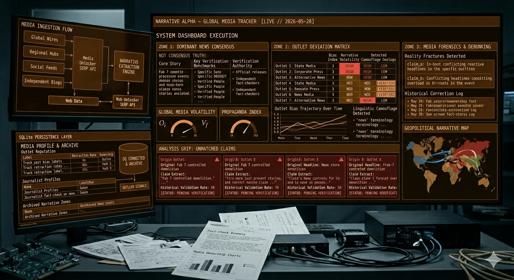

<div align="center">
  
</div>

# Narrative Alpha

**Forensic narrative analysis for news intelligence.**

Built for [Web Data UNLOCKED](https://luma.com/k9vgqtfp) — Bright Data's two-day enterprise AI hackathon in San Francisco, May 30–31, 2026.

---

## What It Does

Narrative Alpha ingests news articles about a target event from multiple outlets, extracts a structured knowledge graph from each, computes a consensus baseline, then surfaces exactly how each outlet deviated — factual omissions, linguistic spin, and outlier claims. It tracks outlet reputation over time, surfacing which sources consistently front-run what the consensus later acknowledges.

**This is not a fact-checker or misinformation detector.** It maps narrative topology — what the institutional press agrees on, who omitted what, and who spun it.

| What This Is NOT | | What This Tries To Be |
|---|---|---|
| Generic "AI research assistant" | | **Opinionated** — makes explicit calls about omission, spin, and outlier provenance |
| Scraping + summarization | | **Metricized** — every output is a scored, measurable claim, not prose summary |
| RAG over web data | | **Forensic rather than assistive** — interrogates sources instead of answering user questions |
| Autonomous browsing agents | | **Structurally decomposed** — graph extraction and set math, not agentic tool-calling loops |
| Market-news summarizers | | Measures epistemic distortion across sources rather than retrieving relevant content |
| Sentiment dashboards | | |
| Lead generation / SEO automation | | |
| Generic "multi-agent" wrappers | | |

## How It Works

```
Articles → Knowledge Graphs → Consensus Baseline → Distortion Matrix → Dashboard
```

1. **Ingest** — Bright Data SERP API + Web Unlocker pull articles from multiple outlets
2. **Normalize** — Fast LLM resolves entity synonyms across sources
3. **Extract** — Reasoning LLM builds structured node-and-edge graphs per article
4. **Analyze** — Set math identifies omissions, embedding distance catches spin, provenance tracking flags outliers
5. **Display** — Static dashboard renders the forensic report

## Core Metrics

| Metric | What It Measures |
|--------|-----------------|
| **Omission Index** (Oᵢ) | What facts did this outlet leave out? |
| **Framing Volatility** (V<sub>f</sub>) | How much spin did they layer on? |
| **Scatter-Shot Anomaly** (S<sub>a</sub>) | Does this outlet pump out noise? |
| **Consensus Baseline** (G<sub>c</sub>) | What does everyone agree on? |

## Stack

| Layer | Technology |
|-------|-----------|
| **Scraping** | Bright Data SERP API + Web Unlocker |
| **LLM** | DeepSeek V4 (Flash + Pro w/ thinking mode) |
| **Embeddings** | OpenAI `text-embedding-3-small` |
| **Compute** | Modal Serverless (Python 3.11) |
| **Storage** | SQLite (WAL mode, Modal Volume) |
| **Frontend** | Static HTML/JS |

## Track

Finance & Market Intelligence — Web Data UNLOCKED Hackathon, 2026.

## Quick Start

> Implementation in progress. See `docs/spec-v1-4.md` for the full technical specification.

```bash
# Clone
git clone git@github.com:afshinator/narrative-alpha.git
cd narrative-alpha

# Install
python -m venv .venv && source .venv/bin/activate
pip install -r requirements.txt

# Deploy to Modal
modal deploy app.py
```

## License

MIT
