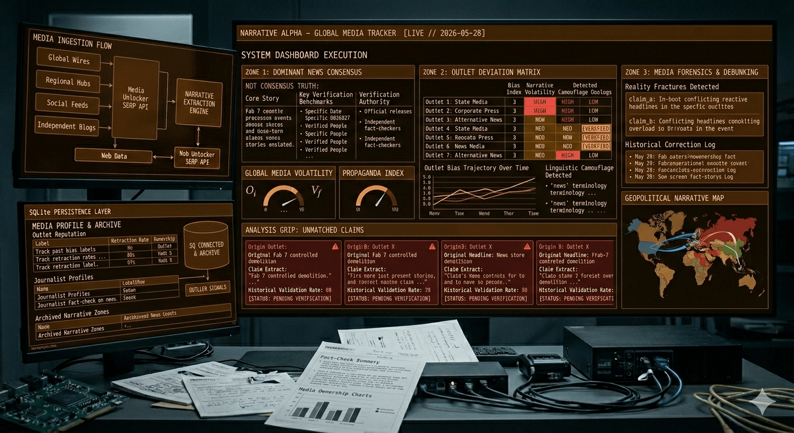
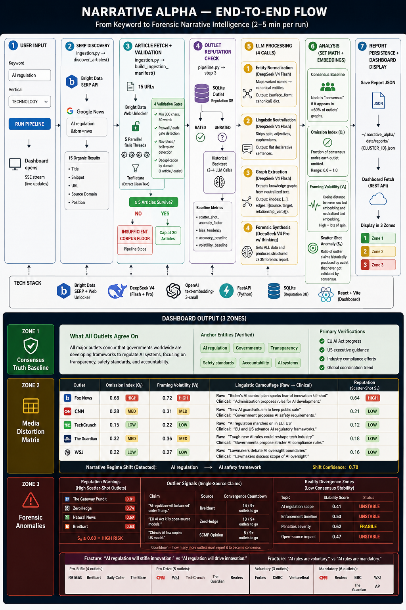

<div align="center">
  
</div>

# Narrative Alpha

**Forensic narrative analysis for news intelligence.**

Built for [Web Data UNLOCKED](https://luma.com/k9vgqtfp) — [Bright Data](https://brightdata.com/)'s two-day enterprise AI hackathon in San Francisco, May 30–31, 2026.

---

## What It Does

Narrative Alpha ingests news articles about a target event from multiple outlets, extracts a structured knowledge graph from each, computes a consensus baseline, then surfaces exactly how each outlet deviated — factual omissions, linguistic spin, and outlier claims. It tracks outlet reputation over time, surfacing which sources consistently front-run what the consensus later acknowledges.

**This is not a fact-checker or misinformation detector.** It maps narrative topology — what the institutional press agrees on, who omitted what, and who spun it.

| What This Is NOT | | What This Tries To Be |
|---|---|---|
| Generic "AI research assistant" | | **Opinionated** — makes explicit calls about omission, spin, and outlier provenance |
| Scraping + summarization | | **Metricized** — every output is a scored, measurable claim, not prose summary |
| RAG over web data | | **Forensic rather than assistive** — interrogates sources instead of answering user questions |
| Autonomous browsing agents | | **Structurally decomposed** — graph extraction and set math, not agentic tool-calling loops |
| Market-news summarizers | | Measures epistemic distortion across sources rather than retrieving relevant content |
| Sentiment dashboards | | |
| Lead generation / SEO automation | | |
| Generic "multi-agent" wrappers | | |

## How It Works

```
Articles → Knowledge Graphs → Consensus Baseline → Distortion Matrix → Dashboard
```

1. **Ingest** — Bright Data SERP API + Web Unlocker pull articles from multiple outlets
2. **Normalize** — Fast LLM resolves entity synonyms across sources
3. **Extract** — Reasoning LLM builds structured node-and-edge graphs per article
4. **Analyze** — Set math identifies omissions, embedding distance catches spin, provenance tracking flags outliers
5. **Display** — Static dashboard renders the forensic report

<div align="center">
  
</div>

## Core Metrics

| Metric | What It Measures |
|--------|-----------------|
| **[Omission Index](docs/core-metrics.md#2-omission-index-oi)** (Oᵢ) | What facts did this outlet leave out? |
| **[Framing Volatility](docs/core-metrics.md#3-framing-volatility-vf)** (V<sub>f</sub>) | How much spin did they layer on? |
| **[Scatter-Shot Anomaly](docs/core-metrics.md#4-scatter-shot-anomaly-sa)** (S<sub>a</sub>) | Does this outlet pump out noise? |
| **[Consensus Baseline](docs/core-metrics.md#1-consensus-baseline-gc)** (G<sub>c</sub>) | What does everyone agree on? |

## Stack

| Layer | Technology |
|-------|-----------|
| **Scraping** | Bright Data SERP API + Web Unlocker |
| **LLM** | Configurable per pipeline step — DeepSeek, OpenAI, Google, Groq (any OpenAI-compatible endpoint) |
| **Embeddings** | OpenAI `text-embedding-3-small` (hardcoded — see Known Limitations) |
| **Backend** | FastAPI + uvicorn (Python 3.11) |
| **Storage** | SQLite (WAL mode) |
| **Frontend** | React + Vite |

## Track

Finance & Market Intelligence — Web Data UNLOCKED Hackathon, 2026.

## Quick Start

**Requires:** Python 3.11+, Node.js 18+, npm

```bash
git clone git@github.com:afshinator/narrative-alpha.git
cd narrative-alpha

cp .env.example .env
# Fill in BRIGHTDATA_API_KEY, DEEPSEEK_API_KEY, OPENAI_API_KEY

./start-demo.sh
```

The script installs Python and dashboard dependencies on first run. Open the URL it prints when ready — backend on port 8000, dashboard on port 5173 by default.

**Port overrides** (set in `.env` or inline):

```bash
BACKEND_PORT=9000 PORT=3005 ./start-demo.sh
```

## Known Limitations

**Embeddings require OpenAI.** Framing volatility scores are computed using embedding distance (`text-embedding-3-small`). This call is hardcoded to OpenAI — `OPENAI_API_KEY` is always required even if you configure every other pipeline step to use a different provider (DeepSeek, Groq, etc.). Making the embedding provider configurable is a planned improvement.

## License

MIT
